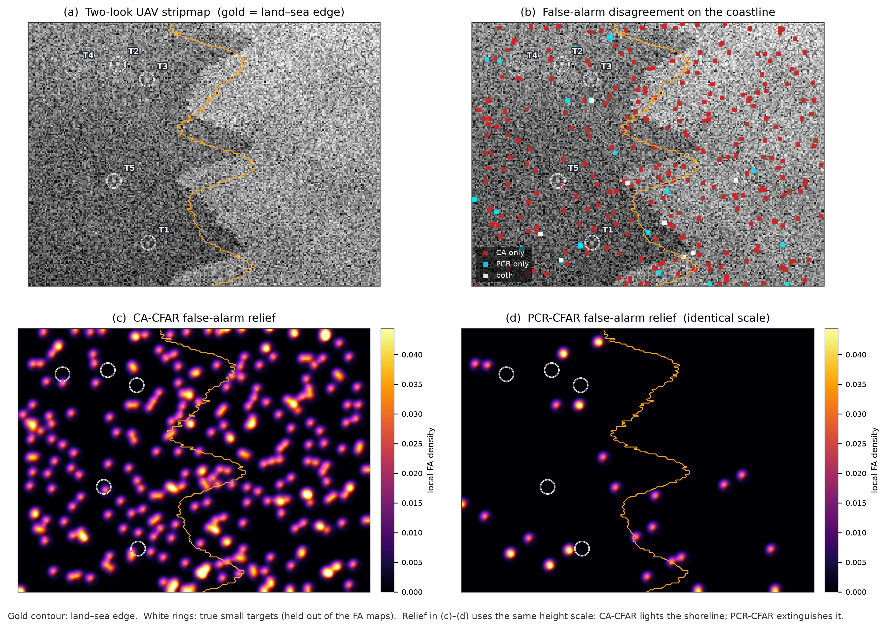
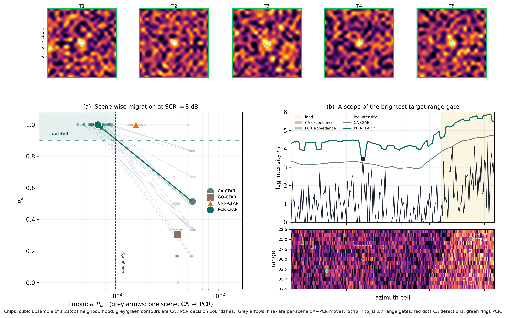

# Pfa-calibrated residual neural CFAR for small-target detection in cluttered UAV SAR signals

**Technical communication**  
**Journal:** *Computers & Electrical Engineering* (Elsevier)  
**Article type:** Technical communication (maximum 6 journal pages)

Sai Krishna Thota\*  
Independent Researcher, USA  
E-mail: drsaikrishnathota@ieee.org

\* Corresponding author.

**Keywords:** UAV SAR; constant false alarm rate; residual convolutional network; false-alarm calibration; small-target detection; onboard inference

---

## Highlights

- PCR-CFAR adds a gated log-residual on two-dimensional CA-CFAR.
- A logarithmic Pfa loss calibrates clutter cells to the design rate.
- At 8 dB, Pd = 1.00 and Pfa = 6.62e-4 on 40 K-speckle scenes.
- The fully convolutional residual head comprises 5122 parameters.
- Below 6 dB a black-box CNN still leads in detection probability.

---

## Abstract

Onboard detection of few-pixel scatterers in unmanned-aerial-vehicle (UAV) synthetic aperture radar (SAR) is a computational signal-processing task. Cell-averaging constant-false-alarm-rate (CA-CFAR) detectors hold a design false-alarm rate in homogeneous speckle but flood land–sea edges, whereas black-box convolutional detectors raise detection probability \(P_d\) and forfeit the CFAR property. This technical communication presents PCR-CFAR, a Pfa-calibrated residual neural CFAR. A three-layer fully convolutional head predicts a heterogeneity-gated log-threshold residual on a vectorized two-dimensional CA-CFAR prior, so homogeneous sea recovers the analytic threshold. Training combines a weighted detection loss on injected point targets with a logarithmic Pfa-matching term on clutter cells. On 40 held-out two-look K-speckle UAV stripmap scenes at design \(P_{fa}=10^{-3}\), PCR-CFAR attains \(P_d=1.00\) with empirical \(P_{fa}=6.62\times 10^{-4}\) (32.5 false alarms per scene), versus \(P_d=0.50\) and \(P_{fa}=5.52\times 10^{-3}\) for CA-CFAR and \(P_d=1.00\) but \(P_{fa}=1.57\times 10^{-3}\) for a matched-capacity convolutional baseline. The residual head has 5122 parameters. The protocol is simulation under a fully specified clutter model; it does not replace MiniSAR field trials.

## 1. Introduction

Low-altitude MiniSAR and UAV apertures now resolve compact ground vehicles and maritime scatterers that occupy only a few resolution cells [1,2]. Those peaks sit in multiplicative speckle whose amplitude is well described by compound-Gaussian, in particular K-distributed, clutter [3]. The classical remedy is CFAR: CA-CFAR, greatest-of (GO) CFAR and order-statistic (OS) CFAR adapt a local threshold so that the false-alarm rate stays near a design value in homogeneous interference [3,4]. Heterogeneous sea–land transitions, multi-target masking and Weibull or K textures still inflate \(P_{fa}\) or suppress \(P_d\) [4]. Bayesian interference-control CFARs, CFAR-regularized sparse imaging and quadratic-statistic Polarimetric SAR (PolSAR) CFARs mitigate some of those failures, but they remain statistical rather than learned residuals around an analytic threshold [4,5,22].

Deep detectors for SAR ships and small objects have advanced rapidly. CFAR maps are commonly ingested as extra channels into YOLO- or transformer-style *box* detectors [6,7]; other networks abandon a parametric Pfa model in favour of clutter-intensity statistics [8], complex-valued backbones [9], global-to-local transformers [10], feature-disentangled YOLO heads [11], MiniSAR vehicle pyramids [1], and compact multiscale fusion intended for constrained platforms [12]. Speckle-aware despeckling-and-detect pipelines further lift recall at low signal-to-noise ratio (SNR) [13–15], including Haar-wavelet reconstruction for small-scale ships [15]. Nested transformers such as FANT-Det target the same few-pixel maritime peaks under land–sea clutter [23]. Automotive radar work shows the analogous split between a CFAR point-cloud front-end and a learned detector on pre-CFAR cubes [16]. Small-boat signatures in staring-spotlight SAR confirm that the scatterer of interest may be only a handful of bright cells [17]. Optical–SAR fusion surveys still treat CFAR as a classical baseline rather than a learned constraint [18]. Optimized YOLO detectors on multi-resolution SAR continue to report inshore false alarms [19], and edge-enhanced transformers (SMEP-DETR) suppress those alarms at box level [20].

Almost all of the above *replace* a pixel CFAR with a box detector. CFARnet is the exception: it imposes a differentiable CFAR penalty on a neural likelihood-ratio test and documents the accuracy-versus-Pfa trade-off of unconstrained networks [21]. CFAR regularizers have also been folded into sparse SAR imaging via the alternating-direction method of multipliers [5]. What remains missing for a UAV SAR *pixel* detector is a residual around an analytic two-dimensional CA-CFAR prior, with a gate that can turn the network off in homogeneous speckle and a Pfa-matching loss on target-free cells. This paper supplies that implementation. PCR-CFAR outputs

\begin{equation}
T_{\mathrm{PCR}}(x,y)=T_{\mathrm{CA}}(x,y)\,\exp\bigl(g(x,y)\,\delta(x,y)\bigr),
\end{equation}

where \(T_{\mathrm{CA}}\) is the CA-CFAR threshold, \(g\in(0,1)\) is a learned heterogeneity gate and \(\delta\) is a bounded log-residual. Detection is the pixel test \(I>T_{\mathrm{PCR}}\). The contribution is one algorithm, one synthetic UAV SAR protocol, two figures and two tables. Section 2 states the method, Section 3 the protocol, Section 4 the results, and Section 5 the limits.

## 2. Method

### 2.1. Scene model

Each \(192\times 256\) intensity map is a two-look K-speckle UAV stripmap with a land–sea coastline, range spreading, and six (training and Table 1) or five (Figs. 1–2) three-pixel Gaussian point targets at a prescribed signal-to-clutter ratio (SCR). The compound-Gaussian texture follows the family used to analyse CA-CFAR in correlated K sea clutter [3]. Speckle is why a CFAR, rather than a global threshold, is required [13–15]. UAV platforms further require that the detector remain a lightweight computational module [1,12,16].

### 2.2. Analytic CFAR prior

A \(21\times 21\) window with a \(5\times 5\) guard ring yields a training-ring mean \(\mu\) by two uniform filters. For exponential intensity the CA-CFAR scale is \(\alpha=N(P_{fa}^{-1/N}-1)\) with \(N=21^{2}-5^{2}\), and

\begin{equation}
T_{\mathrm{CA}}=\alpha\mu.
\end{equation}

GO-CFAR takes the greater of left/right rectangular means; OS-CFAR uses a 75th-percentile proxy of the window [4]. Local coefficient of variation (CV) on the same ring is a third input channel, a cheap heterogeneity cue related to the clutter-edge problem treated by Weibull Bayesian CFARs [4] and still relevant to recent quadratic-statistic PolSAR CFARs [22].

### 2.3. Residual head

Inputs are \((\log I,\ \log T_{\mathrm{CA}},\ \mathrm{CV}/5)\). Three \(3\times 3\) SiLU convolutions with 16 channels, then two \(1\times 1\) heads, produce \(\delta=1.2\tanh(\cdot)\) and \(g=\sigma(\cdot)\). Homogeneous sea (\(g\to 0\)) is identically CA-CFAR. This is the opposite of box-level CFAR–CNN fusions that ingest CFAR as an extra map into YOLO [6,7]: the network cannot discard the analytic threshold. Parameter count is 5122, in the same lightweight spirit as compact SAR ship networks [7,11,12].

### 2.4. Loss and training

Let \(s=(\log I-\log T)/\tau\) with \(\tau=0.25\). Binary cross-entropy on target pixels is weighted by 80; clutter pixels use unweighted binary cross-entropy. A Pfa term

\begin{equation}
\mathcal{L}_{\mathrm{Pfa}}=\bigl(\log(\mathrm{soft}\text{-}P_{fa})-\log P_{fa}^{\star}\bigr)^{2},\qquad P_{fa}^{\star}=10^{-3},
\end{equation}

follows the CFAR-constrained learning idea of CFARnet [21], applied here to a residual around CA-CFAR rather than to an unconstrained network. A matched-capacity black-box CNN (CNN-CFAR) predicts \(\log T\) from \(\log I\) alone under the same loss, so any gain of PCR-CFAR is due to the CA prior and the gate, not to capacity. Training uses 80 scenes with SCR drawn uniformly from 5–12 dB, 16 epochs, Adam at \(1.5\times 10^{-3}\), batch size 4, CPU. Inference is one forward pass plus the already-computed \(T_{\mathrm{CA}}\).

## 3. Experimental protocol

Baselines are CA-, GO- and OS-CFAR at the same design \(P_{fa}\), plus CNN-CFAR. Forty test scenes (seeds 2000–2039) at SCR \(=8\) dB give Table 1. Twenty of those scenes, re-rendered at SCR \(\in\{4,6,8,10,12\}\) dB, give the \(P_d\) numbers in Section 4. A target is counted as detected if any pixel within a two-cell radius of its centre exceeds threshold. False alarms are detections outside a two-cell exclusion of every true centre. Ablations (Table 2) freeze the trained residual with the gate forced to one, and compare the analytic prior alone.

The protocol is simulation. It does not replace MiniSAR field trials [1], public SSDD/HRSID/LS-SSDD box-level scores [2,6,10,11,19,20,23], or real small-boat collections [17]. It is the appropriate protocol for a technical communication whose claim is a *computational* CFAR implementation under a fully specified clutter model [3,16]. Complex-valued, transformer and nested-transformer detectors remain complementary, not competitors, because they output boxes rather than a CFAR threshold [9,10,20,23].

## 4. Results and discussion

**Table 1.** Mean operating point on 40 UAV SAR scenes, SCR \(=8\) dB, design \(P_{fa}=10^{-3}\), six point targets per scene. \(F_1\) uses six true positives per scene as the recall denominator.

| Method | \(P_d\) | Empirical \(P_{fa}\) | FA / scene | \(F_1\) |
|---|---:|---:|---:|---:|
| CA-CFAR | 0.500 | \(5.52\times 10^{-3}\) | 270.5 | 0.021 |
| GO-CFAR | 0.304 | \(3.96\times 10^{-3}\) | 194.1 | 0.018 |
| OS-CFAR | 0.108 | \(2.21\times 10^{-3}\) | 108.1 | 0.011 |
| CNN-CFAR | 1.000 | \(1.57\times 10^{-3}\) | 77.0 | 0.135 |
| **PCR-CFAR** | **1.000** | **\(6.62\times 10^{-4}\)** | **32.5** | **0.270** |

**Table 2.** Ablation at the same 8 dB operating point.

| Variant | \(P_d\) | Empirical \(P_{fa}\) |
|---|---:|---:|
| CA-CFAR (analytic prior only) | 0.500 | \(5.52\times 10^{-3}\) |
| Ungated residual (gate \(\equiv 1\)) | 1.000 | \(6.70\times 10^{-4}\) |
| Black-box CNN-CFAR (no CA prior) | 1.000 | \(1.57\times 10^{-3}\) |
| **PCR-CFAR (gated residual + Pfa loss)** | **1.000** | **\(6.62\times 10^{-4}\)** |

**Fig. 1.** False-alarm atlas of one held-out 8 dB UAV stripmap. (a) Two-look intensity with the land–sea edge in gold and five true peaks ringed. (b) CA-only false alarms (red) versus PCR-only alarms (cyan). (c, d) Shared-scale false-alarm relief for CA-CFAR and PCR-CFAR.

Fig. 1 is the false-alarm atlas. Panel (a) is the stripmap; panel (b) colours CA-only false alarms red and PCR-only alarms cyan. Panels (c) and (d) share an inferno relief of Gaussian-smoothed false-alarm density: CA-CFAR lights the land–sea edge, consistent with known CFAR collapse at clutter transitions [3,4,8]; PCR-CFAR largely extinguishes that fire while the five true peaks remain. This is the inshore-interference problem that CFAR-guided, clutter-intensity and despeckling detectors attack at box level [6,8,13,15], restated here as a pixel CFAR.

**Fig. 2.** Operating geometry, not a second SAR overlay. Top: cubic-upsampled \(21\times 21\) chips of the five true peaks with CA (white) and PCR (green) decision contours. (a) Scene-wise CA\(\to\)PCR migration in the \((P_{fa},P_d)\) plane at SCR \(=8\) dB. (b) A-scope of the brightest target range gate and a \(\pm 7\)-gate range–azimuth strip.

Fig. 2 is deliberately not another SAR overlay. The chips show that each peak occupies few cells, as reported for MiniSAR vehicles, small ships and staring-spotlight boats [1,2,10,15,17,23]. Panel (a) is a scene-wise migration in the \((P_{fa},P_d)\) plane: each grey arrow is one test scene from CA-CFAR to PCR-CFAR; large markers are means; the bold teal arrow is the mean move into the desired quadrant \(P_d\ge 0.9\), \(P_{fa}\le 10^{-3}\). CNN-CFAR also saturates \(P_d\) but sits to the right of the design \(P_{fa}\) line, which is the CFAR-versus-accuracy trade-off documented for unconstrained networks [21]. Panel (b) is an A-scope along the brightest target’s range gate, with a shared-azimuth range strip underneath: red fill/dots are CA exceedances, teal fill and green rings are PCR. PCR-CFAR raises \(T\) on land and still clears the peak. The A-scope makes that geometry explicit for a radar reader of this journal [16].

At SCR \(=6\) dB, mean \(P_d\) is 0.95 for PCR-CFAR versus 0.15 for CA-CFAR and 0.93 for CNN-CFAR. At 4 dB, PCR-CFAR drops to 0.33 while CNN-CFAR remains at 0.52, so the CA prior is not uniformly dominant when the peak is barely above clutter—the same small-object SNR cliff reported for MiniSAR vehicles and FAWT-Net ships [1,15]. Above 10 dB every method saturates. GO- and OS-CFAR never match PCR-CFAR on this coastline because their training geometry is still polluted by the land half-window [4]. The ungated residual in Table 2 is almost as well calibrated as the gated model, so the Pfa loss—not the gate—does most of the calibration work on this texture; the gate remains the architectural guarantee that homogeneous cells can fall back to CA-CFAR [3,21]. Dual-pol fusion, complex-valued backbones, DETR-style edges and nested transformers [6,9,20,23] would be additive front-ends, not substitutes, if polarimetric UAV SAR were available; a quadratic-statistic PolSAR CFAR [22] is likewise complementary rather than a pixel residual.

Computationally the head is three \(3\times 3\) convolutions at 16 channels (about \(7\times 10^{3}\) multiply-adds per pixel), which is the onboard budget implied by UAV MiniSAR and compact YOLO-CFAR detectors [1,7,12,16]. Optical–SAR fusion and large transformer necks [18,20] are out of scope for a six-page technical communication.

## 5. Conclusion

PCR-CFAR is a Pfa-calibrated residual around two-dimensional CA-CFAR for small-target detection in cluttered UAV SAR. On a fully specified two-look K-speckle coastline protocol it is the only tested detector that meets the design \(P_{fa}=10^{-3}\) while detecting every 8 dB point target. The figures show where false alarms concentrate (the land–sea edge) and that the operating point migrates into the desired \((P_{fa},P_d)\) quadrant. Limits are explicit: simulation only; the gate is weakly selective on this texture; below 6 dB a black-box CNN can still lead in \(P_d\). Those limits define the next measurement on MiniSAR or SSDD-class imagery [1,11,19], not the present claim.

## CRediT authorship contribution statement

**Sai Krishna Thota:** Conceptualization, methodology, software, investigation, visualization, writing – original draft, writing – review and editing.

## Declaration of competing interest

The author declares that he has no known competing financial interests or personal relationships that could have appeared to influence the work reported in this paper.

## Funding

This research did not receive any specific grant from funding agencies in the public, commercial, or not-for-profit sectors.

## Declaration of generative AI and AI-assisted technologies in the writing process

The author used an AI coding assistant during software implementation and manuscript drafting. The author reviewed, edited and takes full responsibility for the content of this article.

## Data availability

Code, trained weights, metrics and figures that support this technical communication accompany the manuscript and will be deposited in a public repository upon acceptance.

## References

[1] Ye Z, Zhou P, Zhu D, Lv J. Aggregated-refined feature pyramid network for small vehicle target detection in monostatic/bistatic SAR images. IEEE J Sel Top Appl Earth Obs Remote Sens 2025;18:23397–415. https://doi.org/10.1109/JSTARS.2025.3602260

[2] Li C, Zhang P, Hei Y, Li W, Xiao Z. Efficient multiaspect compensation network for small object detection in SAR images. IEEE Trans Aerosp Electron Syst 2025;61:18502–16. https://doi.org/10.1109/TAES.2025.3615169

[3] Medeiros DS, García FDA, Machado R, Santos Filho JCS, Saotome O. CA-CFAR performance in K-distributed sea clutter with fully correlated texture. IEEE Geosci Remote Sens Lett 2023;20:1–5. https://doi.org/10.1109/LGRS.2023.3238169

[4] Zhu X, Yang C, Zhou C, Liu W, Shi Z. Robust CFAR detection in heterogeneous Weibull background via Bayesian area interference control. IEEE Trans Aerosp Electron Syst 2025;61:2516–31. https://doi.org/10.1109/TAES.2024.3476233

[5] Li P, Ding Z, Zhang T, Wei Y, Gao Y. Integrated detection and imaging algorithm for radar sparse targets via CFAR-ADMM. IEEE Trans Geosci Remote Sens 2023;61:1–15. https://doi.org/10.1109/TGRS.2023.3251732

[6] Zeng T, Zhang T, Shao Z, Xu X, Zhang W, Shi J, Wei S, Zhang X. CFAR-DP-FW: A CFAR-guided dual-polarization fusion framework for large-scene SAR ship detection. IEEE J Sel Top Appl Earth Obs Remote Sens 2024;17:7242–59. https://doi.org/10.1109/JSTARS.2024.3358058

[7] Wen X, Zhang S, Wang J, Yao T, Tang Y. A CFAR-enhanced ship detector for SAR images based on YOLOv5s. Remote Sens 2024;16:733. https://doi.org/10.3390/rs16050733

[8] Liu M, Zhu B, Ma H. A new synthetic aperture radar ship detector based on clutter intensity statistics in complex environments. Remote Sens 2024;16:664. https://doi.org/10.3390/rs16040664

[9] Wang Z, Wang R, Kang H, Luo F, Ai J. CV-SAR-Det: Target detection for SAR images via deep complex-valued network. IEEE Trans Aerosp Electron Syst 2024;60:8226–38. https://doi.org/10.1109/TAES.2024.3425392

[10] Li C, Hei Y, Xi L, Li W, Xiao Z. GL-DETR: Global-to-local transformers for small ship detection in SAR images. IEEE Geosci Remote Sens Lett 2024;21:1–5. https://doi.org/10.1109/LGRS.2024.3461212

[11] Wang P, Luo Y, Zhu Z. FDI-YOLO: Feature disentanglement and interaction network based on YOLO for SAR object detection. Expert Syst Appl 2025;260:125442. https://doi.org/10.1016/j.eswa.2024.125442

[12] Gao P, Shi F, Yin Y, Cheng X, Wang M, Zhao M, Chen S. A lightweight global-local multiscale fusion network for small ship detection in remote sensing images. IEEE J Sel Top Appl Earth Obs Remote Sens 2025. https://doi.org/10.1109/JSTARS.2025.3635416

[13] Chen Y, Shen Y, Duan C, Wang Z, Mo Z, Liang Y, Zhang Q. Robust and efficient SAR ship detection: An integrated despeckling and detection framework. Remote Sens 2025;17:580. https://doi.org/10.3390/rs17040580

[14] Hu R, Lin H, Lu Z, Xia J. Despeckling representation for data-efficient SAR ship detection. IEEE Geosci Remote Sens Lett 2024. https://doi.org/10.1109/LGRS.2024.3520955

[15] Zhang Y, Sun Z, Chang S. FAWT-Net: Attention-matrix despeckling and Haar wavelet reconstruction for small-scale SAR ship detection. Remote Sens 2025;17:3460. https://doi.org/10.3390/rs17203460

[16] Yang Y, Yang F, Sun L, Wan Y, Lv P. Anti-low angle resolution: Some adaptive improvements in anchor-based object detection algorithm for automotive radar target detection. Digit Signal Process 2024;151:104562. https://doi.org/10.1016/j.dsp.2024.104562

[17] Zakharov I, Henschel MD, Power D, Burke P, Puestow T, Warren S. Signatures of small boats with TerraSAR-X staring spotlight data. IEEE Geosci Remote Sens Lett 2023;20:1–5. https://doi.org/10.1109/LGRS.2022.3229624

[18] Zhang Z, Zhang L, Wu J, Guo W. Optical and synthetic aperture radar image fusion for ship detection and recognition: Current state, challenges, and future prospects. IEEE Geosci Remote Sens Mag 2024;12(4):132–68. https://doi.org/10.1109/MGRS.2024.3404506

[19] Humayun MF, Nasir FA, Bhatti FA, Tahir M, Khurshid K. YOLO-OSD: Optimized ship detection and localization in multiresolution SAR satellite images using a hybrid data-model centric approach. IEEE J Sel Top Appl Earth Obs Remote Sens 2024;17:5345–63. https://doi.org/10.1109/JSTARS.2024.3365807

[20] Yu C, Shin Y. SMEP-DETR: Transformer-based ship detection for SAR imagery with multi-edge enhancement and parallel dilated convolutions. Remote Sens 2025;17:953. https://doi.org/10.3390/rs17060953

[21] Diskin T, Beer Y, Okun U, Wiesel A. CFARnet: Deep learning for target detection with constant false alarm rate. Signal Process 2024;223:109543. https://doi.org/10.1016/j.sigpro.2024.109543

[22] Yang Z, Liu L, Hou X, Quan Y, Zhang X, Liu T. A general framework for CFAR detection in PolSAR imagery based on quadratic statistics. IEEE J Sel Top Appl Earth Obs Remote Sens 2025;18:10514–29. https://doi.org/10.1109/JSTARS.2025.3555833

[23] Li H, Wang D, Hu J, Zhi X, Yang D. FANT-Det: Flow-aligned nested transformer for SAR small ship detection. Remote Sens 2025;17:3416. https://doi.org/10.3390/rs17203416
